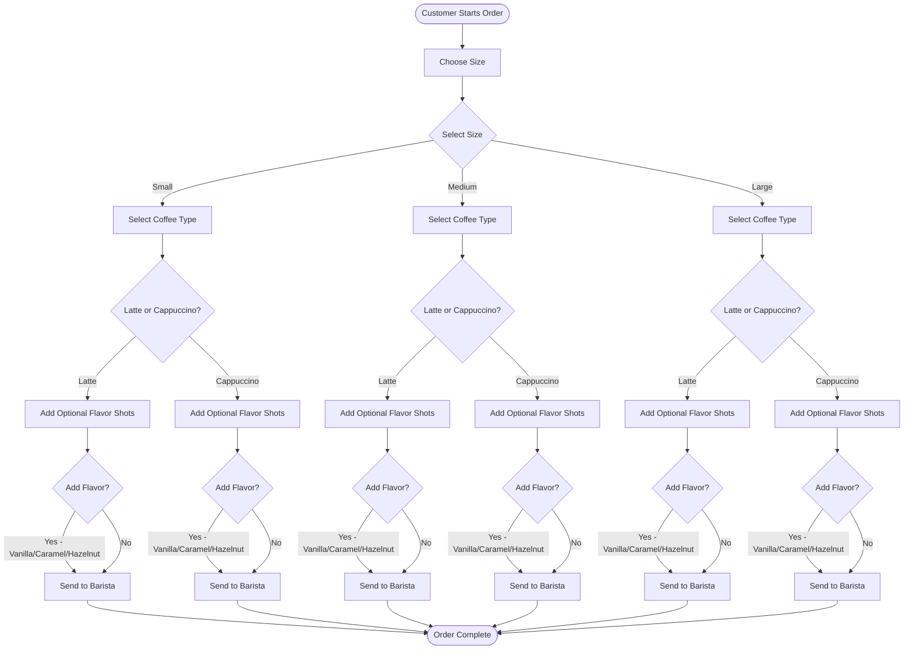

# Coffee Order Process Flowchart

This flowchart details the process for ordering a coffee, from choosing a size to sending the order to the barista.

## Process Steps

1. **Choose Size**: Customer selects Small, Medium, or Large
2. **Select Type**: Customer chooses between Latte or Cappuccino
3. **Add Flavor Shots**: Customer can optionally add flavor shots (Vanilla, Caramel, or Hazelnut)
4. **Send to Barista**: Order is finalized and sent to the barista
5. **Order Complete**: Process ends
